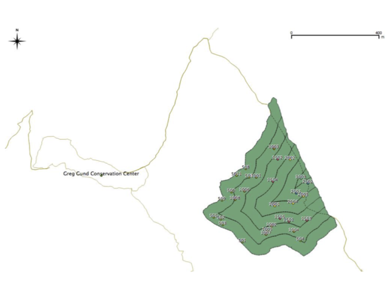

```{r echo=F, results='hide', warning=F}
knitr::opts_chunk$set(echo = F, warning=F)
library(here)
```


## Study site


This study was done in a neotropical lowland rainforest on the Osa Peninsula at the Greg Gund Conservation Center **(GPS)** near the Piro Biological Station run by Osa Conservation.

(See *@taylor15* for a broader ecosystem description of the region.)

The study site was a regrowing 20 ha timber plantation of *Bombacompsis quinata* abandoned in ~1990 after the dry-adapted species from the Guanacaste region *(Pérez Cordero & Kanninen 2002)* grew poorly in very wet conditions.

This focal secondary forest area was roughly triangular, surrounded by primary forest on the two S and NW sides *(Fig \@ref(fig:map))* and a wide service road on the third NE border, with primary forest beyond it.

This census was done in 2013 during the rainy season months between June and August.


## Census design


Edge effects were studied by dividing the secondary forest area into six 50 m strata spanning 0 - 300 m away from the primary forest edge on the S and NW sides, going inward to the E *(Fig \@ref(fig:map))*, using GIS software *(ArcGIS, QGIS)*.

Each stratum was randomly filled with a number of 21 x 21 m square census plots oriented N that was proportional to its area--specifically with 11, eight, five, three, two, and one plot(s), respectively, as distance away from primary forest increased.

The total area of the 30 census plots equaled ~1 ha or 5% of the total secondary forest stand area, which is comparable to similar studies *[@onyekwelu16]*.


```{r map, fig.cap="Map of conservation area on Osa Peninsula, Costa Rica."}
knitr::include_graphics(here("figs/map.png"))
# magick::image_read(path = "../figs/map.png") %>% plot()
```
<!--  -->


## Plot measurements 
<!-- / Data collection -->


### Canopy cover and topography


Light reaching the forest floor was measured at the center of each plot at chest height using a densiometer *(Forestry Suppliers, Inc.)*, as an average of four readings taken facing each cardinal direction.


<!-- ### [Topography] -->


The slope of the forest floor was measured using a rangefinder *(Bushnell, Forestry Suppliers, Inc)* to measure the distance the diagonal between two plot corners and triangulate the observation angle.


### Tree measurements


The diameter of all stems >10 cm wide were recorded in each census plot.

Following common forestry guidelines, in cases where a tree split into 2 or more stems below breast height, each stem was measured separately; in cases where a stem split only above breast height, it was measured as a single stem. 

Tree height was recorded by measuring distances to both the crown and the stem at chest height *(~2.7 m)* using a rangefinder *(Bushnell, Forestry Suppliers, Inc.)* and triangulating the missing side length.

Taxa were identified with localized knowledge and field guides matching common names to Latin binomials, 
and trait information was gathered from the literature.


### Aboveground biomass


Aboveground biomass (AGB) was estimated per stem using the allometric equation by ... *[@chave15]*.

The equation specifically for wet tropical forests was used, which has performed slightly better compared to both pantropical and previous other models by ... *[@chave05] (Ngomanda et al 2014, Alvarez et al 2012)*.

The equation version with height was used since height was accessibly measurable and has shown improved local accuracy *(Khan et al 2020, Domke et al 2012)*.

Wood density (or specific gravity) values when available also improve biomass estimates even more than height *(van Breugel et al 2011)*.

The equation used was:


*AGB = 0.0673 x (ρ D^2 H)^0.976*


with *D* in cm, *H* in m, and *p* in g cm^-3.

Measured DBHs and heights were used and wood densities (*ρ*) extracted from available literature. 

Where information was limited, values at the genus level were used and unrepresented taxa were assumed to be 0.58 following World Agroforestry Database quidelines *(worldagroforestry.org)*.

<!-- *[References used for this step are given in *Table S1*.] * -->

Original values from 2013 were later updated to modern values using the pipeline developed in the *BIOMASS* `r packageVersion("BIOMASS")` R software package by ... *[@réjou-méchain17]*, which notably replaced unknown wood density values with plot-level averages instead during stem biomass calculations. 

<!-- However, these updates did not appear to change the main results of this study. -->


# Statistical analyses


For all response variables, data were analyzed using plot medians and subject to linear regression with the distance to forest edge variable after checks for residual normality and equal variance assumptions using `r version$version.string`.

 <!-- including biomass converted to a per hectare basis,  -->


<!-- Correlated variables were grouped into multi-way ANOVAs---namely biomass, wood density, and diameter in one group; and height, stem density, and wood density in a different group.  -->


Non-linear regressions were run using the function *poly()* in the *stats* `r packageVersion("stats")` R package *(R Core Team 2022)*, 
which was only recorded for stem density and richness variables. 


All trees censused were included in each analysis including unidentified taxa that represented a single group in taxa-specific analyses.

Community analysis and ordination was done as a PERMANOVA with the *vegan* `r packageVersion("vegan")` R package *[@dixon03]*.

Data and code are available at *nmedina17.github.com/osa*.


<!-- `r citation()` -->


<!-- -   Allen and Kim (2020) as some justification for family-level analysis (their MI forest site shares \~6 / their 20 families with this site) -->

<!-- -   Neighborhood influence metric (Lorimer 1983, applied in Looney et al 2016) -->


<!-- - justify metrics, i.e. entropy vs. hists -->
