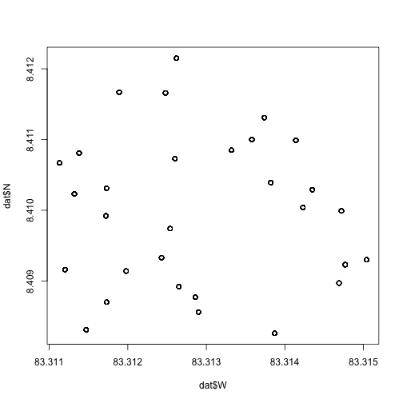
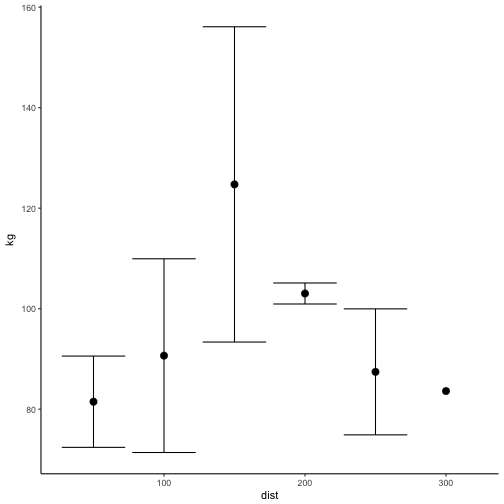
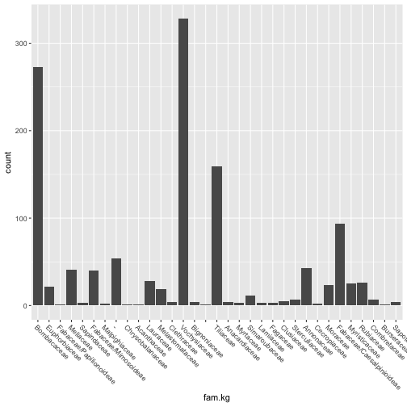
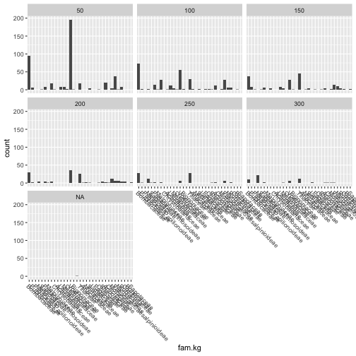
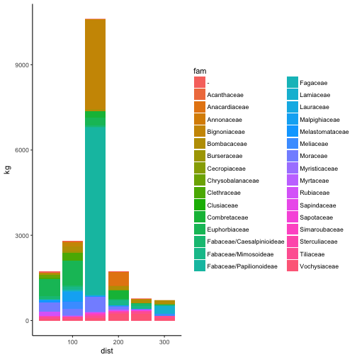
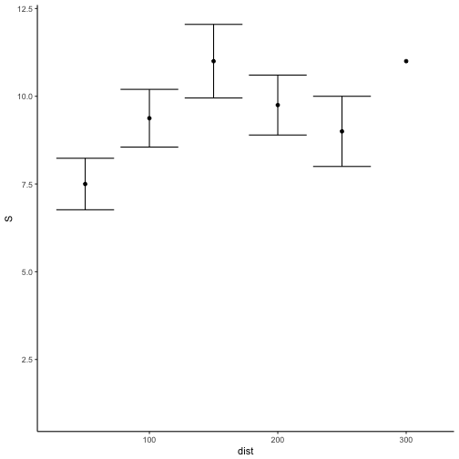
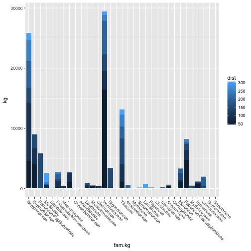
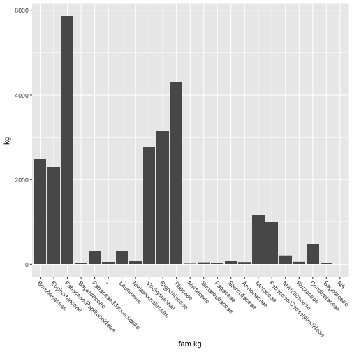
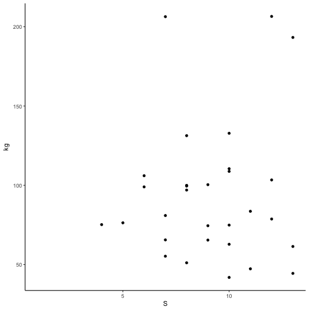

osa
========================================================
author: Nicholas L Medina
date: December 29, 2018
autosize: true


========================================================


```
   ID dist plot n       N        W incl side           fam       gen
1 609   50 50.1 1 8.40826 83.31387   25   21  Vochysiaceae  Vochysia
2 675   50 50.1 1 8.40826 83.31387   25   21     Tiliaceae         -
3 669   50 50.1 1 8.40826 83.31387   25   21 Simaroubaceae Simarouba
4 721   50 50.1 1 8.40826 83.31387   25   21  Vochysiaceae  Vochysia
5 600   50 50.1 1 8.40826 83.31387   25   21  Vochysiaceae  Vochysia
6 604   50 50.1 1 8.40826 83.31387   25   21  Vochysiaceae  Vochysia
          sp   spg  dap  h b kg
1 ferruginea 0.370 17.0 17 5 93
2          - 0.580 12.8 16 6 73
3      amara 0.417  5.7  7 6  6
4 ferruginea 0.370 14.5 17 8 61
5 ferruginea 0.370 11.6 17 7 37
6 ferruginea 0.370 15.3 17 6 72
```

===
# Osa peninsula, Costa Rica

- _Bombacopsis quinata_ plantation, abandoned 20y

===


# 1˚ forest edge effects on adjacent 2˚ restoration



```
            Df Sum Sq Mean Sq F value Pr(>F)
dist         1   1171    1171   0.608  0.442
Residuals   28  53984    1928               
1 observation deleted due to missingness
```

===


```
             Df   Sum Sq Mean Sq F value Pr(>F)    
fam          31 38591607 1244891   17.93 <2e-16 ***
Residuals   241 16729981   69419                   
---
Signif. codes:  0 '***' 0.001 '**' 0.01 '*' 0.05 '.' 0.1 ' ' 1
1 observation deleted due to missingness
```

```
                       Bignoniaceae-- 
                         1.356073e-07 
                      Euphorbiaceae-- 
                         4.585211e-03 
            Fabaceae/Papilionoideae-- 
                         0.000000e+00 
  Fabaceae/Papilionoideae-Acanthaceae 
                         0.000000e+00 
           Bignoniaceae-Anacardiaceae 
                         9.938957e-03 
Fabaceae/Papilionoideae-Anacardiaceae 
                         0.000000e+00 
```


===

# Family frequency, ordered by biomass


===

# Family frequency by edge distance

- Medium-biomass families most common/stems, e.g. Vochysia, Tilia

===

# Regeneration by family



```
NULL
```
- Highest biomass from low-occurrence Fabaceae, at middle (150m) range
- Fabaceae=competitor, Vochysia/Tilia=disperser?

===

# Edge effects on family diversity


- 150m: contains most (~40) _Inga_ (Fabaceae), but are small
- N fert for Bombaceae?

===

# Biomass by family

- Most Bombaceae mass not co-occurring with _Inga_ at 150m

===

## Extra: Family biomass at 150m


===

# Biomass by family richness...


===


```
processing file: osa.Rpres

Attaching package: 'dplyr'

The following objects are masked from 'package:stats':

    filter, lag

The following objects are masked from 'package:base':

    intersect, setdiff, setequal, union

Don't know how to automatically pick scale for object of type data.frame. Defaulting to continuous.
Quitting from lines 175-176 (osa.Rpres) 
Error: Aesthetics must be either length 1 or the same as the data (31): x
In addition: Warning messages:
1: package 'dplyr' was built under R version 3.4.4 
2: package 'bindrcpp' was built under R version 3.4.4 
3: Removed 1 rows containing missing values (geom_point). 
4: Removed 2 rows containing missing values (geom_errorbar). 
5: Removed 1 rows containing missing values (position_stack). 
6: Removed 1 rows containing missing values (geom_point). 
7: Removed 2 rows containing missing values (geom_errorbar). 
8: Removed 1 rows containing missing values (position_stack). 
9: Removed 1 rows containing missing values (position_stack). 
10: Removed 1 rows containing missing values (geom_point). 
Execution halted
```
