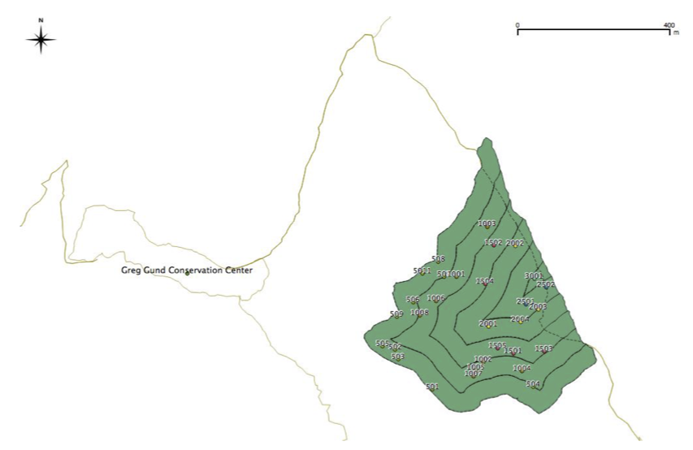

```{r setup, echo=F}
knitr::opts_chunk$set(
  echo=F, quiet=T)
library(
  here
)
i_am(
  "talk/talk.Rpres"
)
#fixRender
library(
  httpuv
)
```


Outline
===

- Introduction
- Methods
- Results
- Discussion


Introduction: Tropical reforestation
===

- Over half are secondary, globally

- Managed recovery can help support local communities

- To make the most of ongoing natural processes, ecological dynamics should be better understood


Introduction: Community patterns
===

- Species richness recovers quickly

- But community composition may take centuries

- So balance of ecosystem service recovery unclear


Introduction: This study
===

- Question:

- Hypothesis:

- Predictions:


Methods: Study site
===

- Wet rainforest, Osa Peninsula, Costa Rica

- 20 ha. timber plantation, became NRDC preserve post-abandonment ~2003

- Surrounded by unmanaged/primary forest on 3 sides, road on other

```{r site}
# nature_img.png
```


Methods: Study design
===

- 300 m transect from unmanaged forest edge inward

- Divided into 50 m bands using Q-, ArcGIS

- 30 plots randomly assigned, but weighted by band area




Methods: Census
===

- DBH, height stems ≥10 cm using rangefinder

- ID by local field guide personnel and books

- plot canopy closure w/ densiometer, and ground slope


# Results: Forest traits along edge

```{r fig1}
source(
  here(
    "figs/fig1.R"
  )
)
fig1
```


Results: Composition along edge
===

```{r fig2}
source(
  here(
    "figs/fig2.R"
  )
)
fig2
```


Results: Dispersal modes along edge
===

```{r fig3}
source(
  here(
    "figs/fig3.R"
  )
)
fig3
```


Discussion
===


<!-- For more details on authoring R presentations please visit <https://support.rstudio.com/hc/en-us/articles/200486468>. -->
