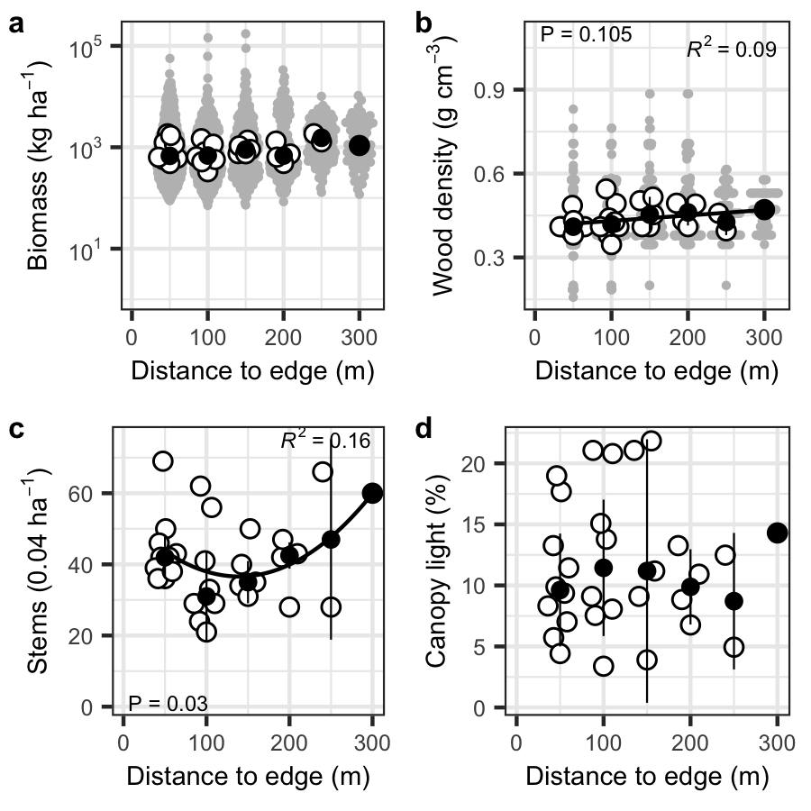
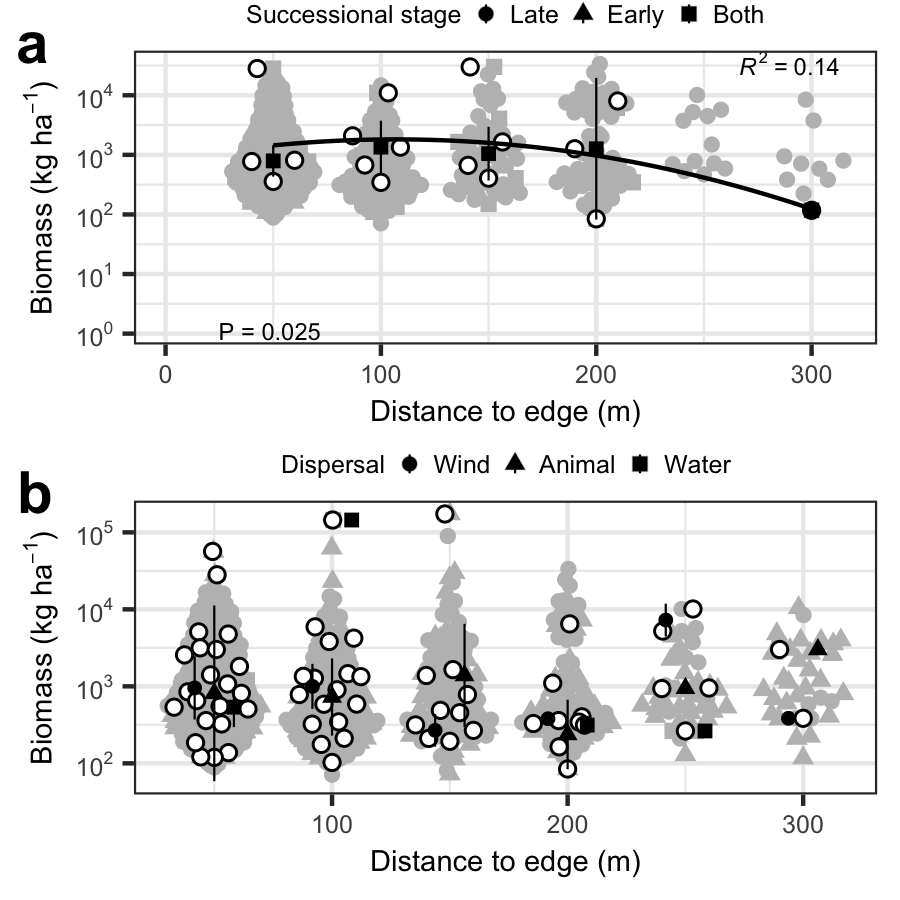

```{r setup, echo = F, include = F}
knitr::opts_chunk$set(echo = F, quiet = T)
library(here); i_am("talk/talk.Rmd")
# #fixRender
# library(
#   httpuv
# )
#embed_file()
# library(
#   xfun
# )
# xfun::pkg_load2(c("htmltools", "mime"))
```


# Outline


- Introduction
- Methods
- Results
- Discussion


# I--Global forests are regenerating, but how?


- ~Half of forests are tropical, and over half of all forests globally are secondary *(FAO 2020)*

- Services like timber and biodiversity depend on natural and managed regeneration patterns

- Regeneration dynamics (e.g. associated biodiversity) should be better understood to optimize sustainable management and service provision


# I--Forest regeneration is overall both quick and inconsistent


- Biomass recovers 90% in 66 yrs *[@poorter16]*

- Taxonomic richness recovers quickly *[@rozendaal19]*

- Community composition may take centuries to recover, if at all *[@norden15]*


# I--Habitat edges shape regeneration


- 70% forests are <1 km from a habitat edge *[@haddad15]*

- Edge effects reduce biodiversity 13 - 75% 

    - more so in small and isolated fragments

- Edge effects may shape diversity via dispersal overlap, possibly peaking at intermediate values *[@yamaguchi22]*


# I--Edge effects may differ in wet tropical plantations


- 7% of global forests are planted and planted area has increased over last 30 yrs *(FAO 2020)*

    - Often dense with fast-growing, shade-intolerant taxa
    
- Wet tropical forest regeneration tends to be light-limited, based on tree functional traits *[@poorter21]*

- Existing plantation demography and shade may skew/buffer edge effects toward net positive instead of negative


# I--This study


- Question -- How is wet tropical secondary forest regeneration affected by former plantation status and edges with road and primary forest?

- Hypothesis -- 

    - Former plantation status facilitates succession by allowing shade-intolerant taxa to grow better due to __denser canopies__
    
    - Forest edges promotes regeneration by faciltating __dispersal__ of shade-tolerant taxa

- Predictions -- Distance away from primary forest edge is associated with --

    - lower stand biomass
    
    - lower tree diversity
    
    - lower shade-tolerant taxa


# II--Study site


- Wet tropical rainforest in Osa Peninsula, SW Costa Rica

- 20 ha plantation of dry forest timber, abandoned in ~2003 into NRDC preserve

- Area surrounded by primary forest on two sides and road on third


```{r site}
# nature_img.png
```


# II--Census design


- Random stratified forest biomass inventory sampling design --

    - divided 300 m range into six 50 m strata, from forest to road edge, using QGIS and ArcGIS

    - 30, 21 x 21 m plots randomly distributed, but quantity roughly proportional to stratum area

    - All plots covered 1 ha total, 5% of entire plantation


# II--Census measurements


- Stems ≥10 cm were measured for DBH and height using rangefinder *(Bushnell, Forestry Suppliers, Inc)*

- Taxa were ID'd with help from local field guides

- Plot canopy closure was measured with densiometer


# II--Statistical analysis


- For all variables--

    - Trend lines follow median values of all plots in distance stratum
    
- Traits obtained from literature and compared to TRY database *[@kattge19]*
    
- Computations done with R `r getRversion()` depending on *BIOMASS* `r packageVersion("BIOMASS")`, 
*vegan* `r packageVersion("vegan")`, and 
*tidyverse* `r packageVersion("tidyverse")` packages


# III--Stand regeneration


- Further from primary forest edge--

    - Biomass and wood density tended to increase

    - Stem density decreased then increased 

    - Neither canopy light nor height (not shown) tended to change
    
- Distance from forest edge tended to explain variation--

    - 10% in wood density
    
    - ~20% in stem density


```{r fig1}
# source(
#   here(
#     "figs/fig1.R"
#   )
# )
# fig1
```





# III--Composition regeneration


- Further from forest edge--

    - Richness tended to increase

    - Diversity decreased steeply

    - Composition varied notably, toward PC1
    
    - Of abundant taxa biomass--
    
        - *Vochysia* tended to decrease
        
        - *Ficus* decreased


```{r fig2}
# source(
#   here(
#     "figs/fig2.R"
#   )
# )
```


# III--Functional regeneration


- Away from forest edge--

    - Biomass of taxa often found in both successional stages decreased

    - Biomass based on dispersal mode remained constant


```{r fig3}
# source(
#   here(
#     "figs/fig3.R"
#   )
# )
# fig3
```





# IV--Hypothesis check


- Stand biomass is more resilient than biodiversity

    - Further from forest--
    
        - No trends in biomass
        
        - Diversity decreased
        
        - Composition tended to change

- Forest edge associated with tree diversity


# IV--Processes underlying patterns


- Not shade, perhaps given high absolute value and/or evenness of original timber planting

- Forest edge may associate with faster succession, given drop in generalist tree taxa with distance

- No signal of dispersal mode detected


# IV--Compare to similar studies


- Aligns well with several recent studies suggesting that--

    - Tree diversity regenerates quicker than taxonomic composition *[@poorter16]*

    - Habitat edges lower diversity and generally slow regeneration, like via less seed consumption *[@hohlenwerger22]*
    
    - Taxa indiscriminate to successional stage are minimally affected by disturbance, like from edges *[@bongers09]*


# IV--Future studies


- Compare wet tropical plantations at different stages of regeneration

- Compare forests with different initial composition but in similar region (i.e. realized vs. fundamental niches)

- Study ecological dynamics under various management conditions      


# Acknowledgements


- James Fifer for initial review

- Lehigh group Don Morris and undergrads for field help

- Brandeis University for funding


\pagebreak


# References


<!-- For more details on authoring R presentations please visit <https://support.rstudio.com/hc/en-us/articles/200486468>. -->
