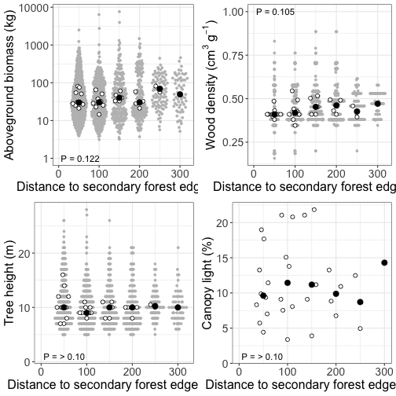
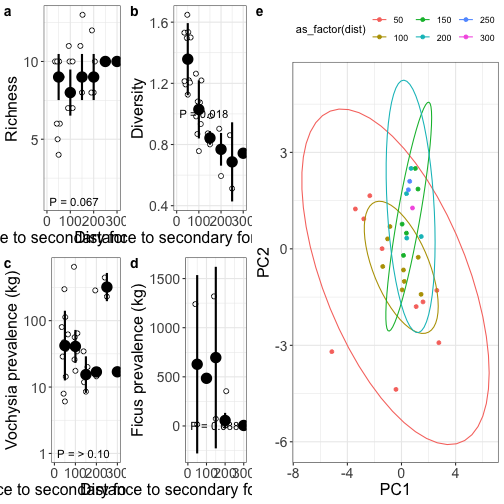

Edge effects on tropical reforestation
===
author: Nicholas Medina
date: 2022
autosize: true


Outline
===

- Introduction
- Methods
- Results
- Discussion


Introduction: Tropical reforestation
===

- Over half are secondary, globally

- Managed recovery can help support local communities

- To make the most of ongoing natural processes, ecological dynamics should be better understood


Introduction: Community patterns
===

- Species richness recovers quickly

- But community composition may take centuries

- So balance of ecosystem service recovery unclear


Introduction: This study
===

- Question:

- Hypothesis:

- Predictions:


Methods: Study site
===

- Wet rainforest, Osa Peninsula, Costa Rica

- 20 ha. timber plantation, became NRDC preserve post-abandonment ~2003

- Surrounded by unmanaged/primary forest on 3 sides, road on other


Methods: Study design
===

- 300 m transect from unmanaged forest edge inward

- Divided into 50 m bands using Q-, ArcGIS

- 30 plots randomly assigned, but weighted by band area


Methods: Census
===

- DBH, height stems ≥10 cm using rangefinder

- ID by local field guide personnel and books

- plot canopy closure w/ densiometer, and ground slope


Results: Forest traits along edge
===


```

  |                                                                            
  |                                                                      |   0%
  |                                                                            
  |======================================================================| 100%
```




Results: Composition along edge
===


```

  |                                                                            
  |                                                                      |   0%
  |                                                                            
  |======================================================================| 100%
```




Results: Dispersal modes along edge
===


```
Error in dots_list(..., title = title, subtitle = subtitle, caption = caption,  : 
  object 'xAxisLabel3' not found
```
